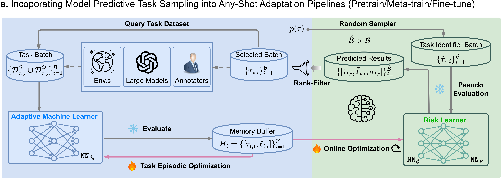

# MPTS

This repository implements the MPTS and baselines proposed in the paper [**"Beyond Any-Shot Adaptation: Predicting Optimization Outcome for Robustness Gains without Extra Pay"**](https://arxiv.org/abs/2501.11039).



## Installation & Applications
Please refer to the following folders for related instructions and code:
- [`sinusoid/`](sinusoid/): Code related to sinusoid regression
- [`MetaRL/`](MetaRL/): Code related to MetaRL scenarios
- [`DR/`](DR/): Code related to Domain Randomization scenarios

## Tutorials

### Quickstart

Get started with [quickstart.ipynb](./quickstart.ipynb) notebook.

## Citation

If you find this work useful, please cite our paper:
```
@article{wang2025beyond,
  title={Beyond Any-Shot Adaptation: Predicting Optimization Outcome for Robustness Gains without Extra Pay},
  author={Wang, Qi Cheems and Xiao, Zehao and Mao, Yixiu and Qu, Yun and Shen, Jiayi and Lv, Yiqin and Ji, Xiangyang},
  journal={arXiv preprint arXiv:2501.11039},
  year={2025}
}
```